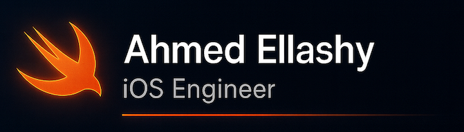

# 💫 About Me:
🚀 <b>I’m currently working on:</b> 
Building high-quality iOS applications using Swift, UIKit, SwiftUI, advanced networking, and clean, scalable architectures. 

🤝 <b>I’m looking to collaborate on:</b> 
iOS open-source libraries, scalable mobile architectures, and performance-focused apps. 

💬 <b>Ask me about:</b> 
iOS development (Swift, UIKit, SwiftUI, Networking, Testing), app architecture, best coding practices, performance optimization, and freelancing tips. 

🌱 <b>I’m currently learning:</b> 
Strengthening leadership and project management skills, improving team communication, and mastering how to plan, organize, and lead full end-to-end software development lifecycles efficiently.

## 🌐 Socials:

# 💻 Tech Stack:

 

 

# 📊 GitHub Stats:

